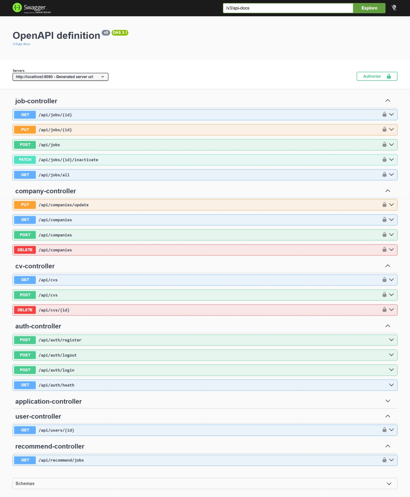
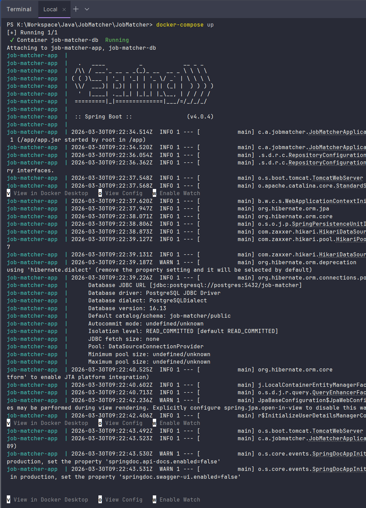
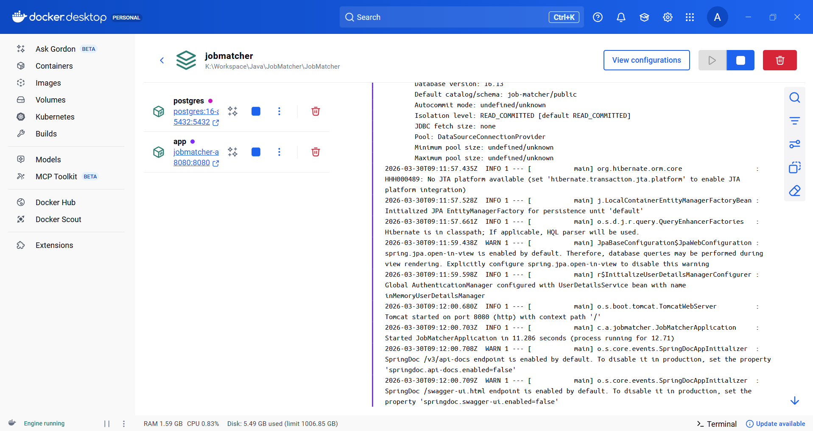
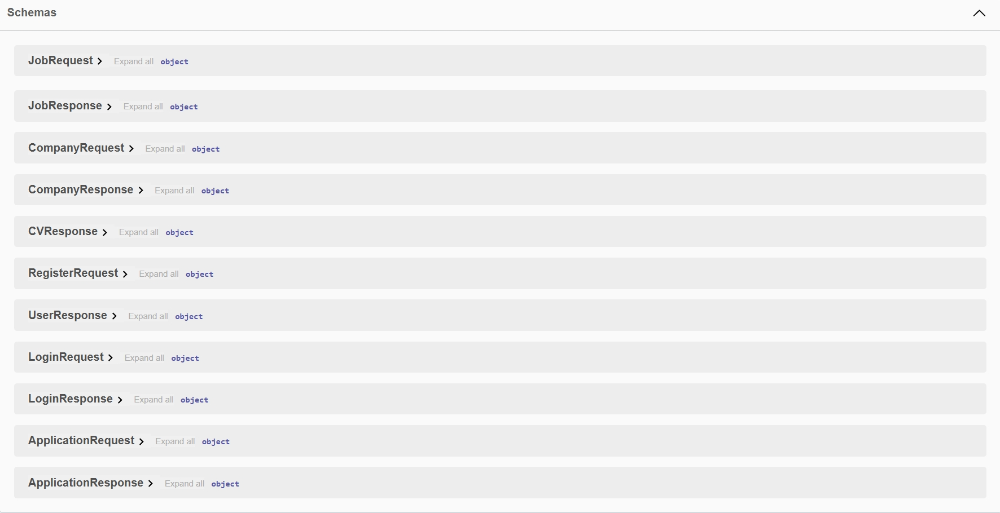

# JobMatcher

Back-end server for job match, built with Spring Boot and PostgreSQL.



## Tech Stack
| Technology                  | Description                             |
|-----------------------------|-----------------------------------------|
| **Java 21 / 22 / 23 / 24**  | Modern Java platform                    |
| **Spring Boot**             | Backend REST API Framework              |
| **PostgreSQL 16**           | Relational database                     |
| **Spring Security + JWT**   | Authentication & Authorization          |
| **Docker & Docker Compose** | Containerized deployment                |

## Project Structure
```
src/main/java/com/axolotl/jobmatcher
├── config/             # Configuration for OpenAPI, RestClient, and Security
├── controller/         # REST API Endpoints (Auth, CV, Job, Recommend, etc.)
├── dto/                # Data Transfer Objects
│   ├── ai/             # AI-specific responses (CV Parse, Job Match)
│   ├── application/    # Application request/response models
│   ├── company/        # Company data models
│   ├── cv/             # CV data models
│   ├── job/            # Job data models
│   └── user/           # Authentication and User profiles
├── entity/             # Database Entities (JPA/Hibernate)
├── exception/          # Custom exceptions and Global Exception Handler
├── repository/         # Data access layer for each Entity
├── scheduler/          # Background tasks and job scheduling
├── security/           # JWT processing and authentication logic
├── service/            # Business logic and integration with AI Service
└── utils/              # Helper classes and shared utilities

src/main/resources
└── application.yaml    # Application configuration
```

## Prerequisites

- Java 24 (or latest LTS)
- Maven 3.9+
- PostgreSQL 16+
- AI Service running → https://github.com/Axololt7923/ai-service.git
- [!Optional] Docker & Docker Compose

## Installation
### 0. ***Install and running ai-service***
https://github.com/Axololt7923/ai-service.git

### 1. ***Clone the repository***
```bash
git clone https://github.com/Axololt7923/JobMatcher.git
cd JobMatcher
```

```bash
mvn clean install
```

### 3. ***Create `.env` file***
```
DB_NAME=name
DB_URL=db_url
DB_USERNAME=username
DB_PASSWORD=password

JWT_SECRET=your_key

AI_SERVICE_URL=your_ai_url
AI_SERVICE_KEY=your_key
```

## Running
```bash
docker-compose up --build
```



# API Documentation

This backend follows a modular REST API architecture covering authentication, job management, companies, CV parsing, job applications, and AI-powered recommendations.

All authenticated endpoints require:

```
Authorization: Bearer <JWT>
```

---

# Authentication API

## **POST /api/auth/register**

Create a new user.

**Body**

```json
{
  "email": "string",
  "password": "string",
  "fullName": "string"
}
```

**Returns** → `UserResponse`

---

## **POST /api/auth/login**

Log in and receive JWT.

**Body**

```json
{
  "email": "string",
  "password": "string"
}
```

**Returns**

```json
{
  "token": "string",
  "user": { }
}
```

---

## **POST /api/auth/logout**

Invalidate token (local use).

---

## **GET /api/auth/heath**

Health check → `"OK"`

---

#  User API

## **GET /api/users/{id}**

Get user information by ID.

**Returns** → `UserResponse[]` (list of users with this ID)

---

#  Company API

## **GET /api/companies**

Query companies.

**Query params**

* `id` (uuid, optional)
* `limit` (default 20)
* `offset` (default 0)

**Returns** → `CompanyResponse[]`

---

## **POST /api/companies**

Create company.

**Body** → `CompanyRequest`
**Returns** → `CompanyResponse`

---

## **PUT /api/companies/update**

Update company.

**Body** → `CompanyRequest`
**Returns** → `CompanyResponse`

---

## **DELETE /api/companies**

Delete company of the authenticated user.

---

# Job API

## **POST /api/jobs**

Create a job posting.

**Body** → `JobRequest`
**Returns** → `JobResponse`

---

## **GET /api/jobs/{id}**

Fetch job by ID.

---

## **PUT /api/jobs/{id}**

Update existing job.

---

## **PATCH /api/jobs/{id}/inactivate**

Mark job as inactive.

---

## **GET /api/jobs/all**

List all jobs.

**Query params**

* `isActive` (boolean, default true)
* `limit`
* `offset`

**Returns** → `JobResponse[]`

---

# CV API

## **GET /api/cvs**

Get CVs of authenticated user.

---

## **POST /api/cvs**

Upload CV.

**Multipart**

```
file: <binary pdf/docx>
```

**Returns** → `CVResponse`

---

## **DELETE /api/cvs/{id}**

Delete CV by ID.

---

# Job Applications API

Future implement

---

## **GET /api/applications/user/{userId}**

Get applications of a user.

---

## **POST /api/applications/user/{userId}**

Apply to job.

**Body** → `ApplicationRequest`

---

## **GET /api/applications/job/{jobId}**

List applications for a job.

---

## **PATCH /api/applications/{id}/status**

Update application status.

**Query param:** `status=[applied|viewed|interviewing|rejected|accepted]`

---

# AI Recommendation API

## **GET /api/recommend/jobs**

Get AI-recommended jobs.

**Query**

* `topK` (default 10)

**Returns** → `JobResponse[]`

---

# Schema Overview (DTOs)



# Notes

* All authenticated APIs require Bearer token.
* CV uploads must use `multipart/form-data`.
* Deprecated endpoints will be removed soon (Applications API).


## Environment Variables

| Variable         | Description          | Required |
|------------------|----------------------|----------|
| `DB_NAME`        | Database name        | Yes      |
| `DB_URL`         | Database url         | Yes      |
| `DB_USERNAME`    | Database user name   | Yes      |
| `DB_PASSWORD`    | Database password    | Yes      |
| `JWT_SECRET`     | JWT key for security | Yes      |
| `AI_SERVICE_URL` | Service url          | Yes      |
| `AI_SERVICE_KEY` | Service api key      | Yes      |

## Deployment
FUTURE UPDATES
